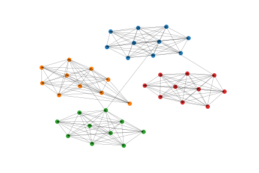

# Graph Neural Networks

This is my personal implementation of several graph neural network research papers, they are listed below.<br>

| Module | Paper |
|--------|-------|
| ```gnn.py``` | [The graph neural network model](https://persagen.com/files/misc/scarselli2009graph.pdf) |
| ```gan.py``` | [Graph Attention Networks](https://arxiv.org/abs/1710.10903) |
| ```gcn.py``` | [Semi-Supervised Classification with Graph Convolutional Networks](https://arxiv.org/abs/1609.02907) |
| ```tgnn.py``` | [Temporal Graph Networks for Deep Learning on Dynamic Graphs](https://arxiv.org/abs/2006.10637) |

### **Setup**
To set up the environment, follow these steps:<br>
1) ```conda create --name env pip```<br>
2) ```conda activate env```<br>
3) ```pip install -r requirements.txt```<br>

### **Usage**
In order to the models, open the notebooks ```run_gnn.ipynb``` or ```run_tgnn.ipynb```.


